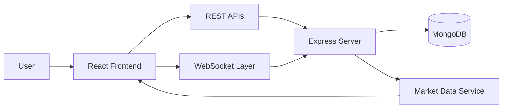

<div align="center">

# 📈 TradeFlow

### Real-Time Stock Trading & Portfolio Management Platform

<p align="center">
  
  
  
  
  
</p>

<p align="center">
  Trade Smarter • Analyze Faster • Invest Better
</p>

</div>

---

## 🚀 Overview

**TradeFlow** is a full-stack stock trading platform designed to simulate modern trading experiences through real-time market monitoring, portfolio management, transaction processing, and interactive analytics.

The platform focuses on scalable architecture, responsive performance, and intuitive financial insights, allowing users to track investments and make informed trading decisions through a modern web interface.

---

## ✨ Features

### 📊 Real-Time Market Dashboard

* Live stock tracking
* Dynamic market updates
* Trending stock analysis
* Interactive charts and visualizations

### 💼 Portfolio Management

* Create and manage portfolios
* Track investment performance
* Monitor gains and losses
* Portfolio allocation insights

### 💹 Trading Engine

* Buy and sell stocks
* Transaction history
* Order management
* Real-time portfolio updates

### 📈 Analytics & Insights

* Market trend analysis
* Profit & loss tracking
* Performance visualization
* Investment monitoring

### 🔐 Security & Authentication

* Secure user authentication
* Protected trading sessions
* Access control mechanisms
* User account management

### 📱 Responsive Experience

* Mobile Friendly
* Tablet Compatible
* Desktop Optimized
* Cross-Browser Support

---

## 🎨 UI/UX Highlights

✅ Modern FinTech Dashboard

✅ Clean Data Visualization

✅ Responsive Design System

✅ Interactive Market Analytics

✅ User-Centric Navigation

✅ Real-Time Feedback

✅ Professional Financial Interface

---

## 🏗️ System Architecture



---

## 📂 Core Modules

### 📊 Market Dashboard

* Stock Monitoring
* Trending Assets
* Price Tracking
* Market Statistics

### 💼 Portfolio Management

* Portfolio Tracking
* Asset Monitoring
* Investment Analysis
* Performance Reports

### 💹 Trading Module

* Buy Orders
* Sell Orders
* Order History
* Transaction Processing

### 📈 Analytics Module

* Market Trends
* Portfolio Growth
* Profit/Loss Reports
* Investment Insights

---

## 🛠️ Tech Stack

### Frontend

* React.js
* JavaScript (ES6+)
* HTML5
* CSS3

### Backend

* Node.js
* Express.js

### Database

* MongoDB

### Communication

* REST APIs
* WebSockets

### Deployment

* Vercel
* Render
* MongoDB Atlas

---

## 📁 Project Structure

```bash
TradeFlow/
│
├── client/
│   ├── components/
│   ├── pages/
│   ├── hooks/
│   └── services/
│
├── server/
│   ├── controllers/
│   ├── routes/
│   ├── models/
│   └── middleware/
│
├── screenshots/
│
├── README.md
│
└── package.json
```

---

## 🚀 Getting Started

### Clone Repository

```bash
git clone https://github.com/your-username/tradeflow.git
```

### Install Dependencies

```bash
npm install
```

### Run Development Server

```bash
npm run dev
```

---

## 🎯 Software Engineering Concepts Applied

* Real-Time Data Processing
* REST API Design
* Scalable Architecture
* Database Modeling
* State Management
* Performance Optimization
* Modular System Design
* Data Visualization

---

## 📚 Learning Outcomes

This project strengthened my understanding of:

* Full-Stack Development
* Financial Data Visualization
* Real-Time Systems
* API Development
* Database Design
* System Architecture
* Software Engineering Principles
* Performance Optimization

---

## 🌟 Future Enhancements

* AI-Based Investment Recommendations
* Watchlist Functionality
* Advanced Technical Indicators
* Real-Time Notifications
* Risk Assessment Dashboard
* Multi-Portfolio Support
* Market News Integration

---

## 👩‍💻 Author

### Umangi Patel

Software Engineering Enthusiast | MERN Stack Developer | Problem Solver

GitHub: https://github.com/Umangi-webdev

---

<div align="center">

⭐ If you found this project useful, give it a star!

Building scalable financial systems, one trade at a time 🚀

</div>

